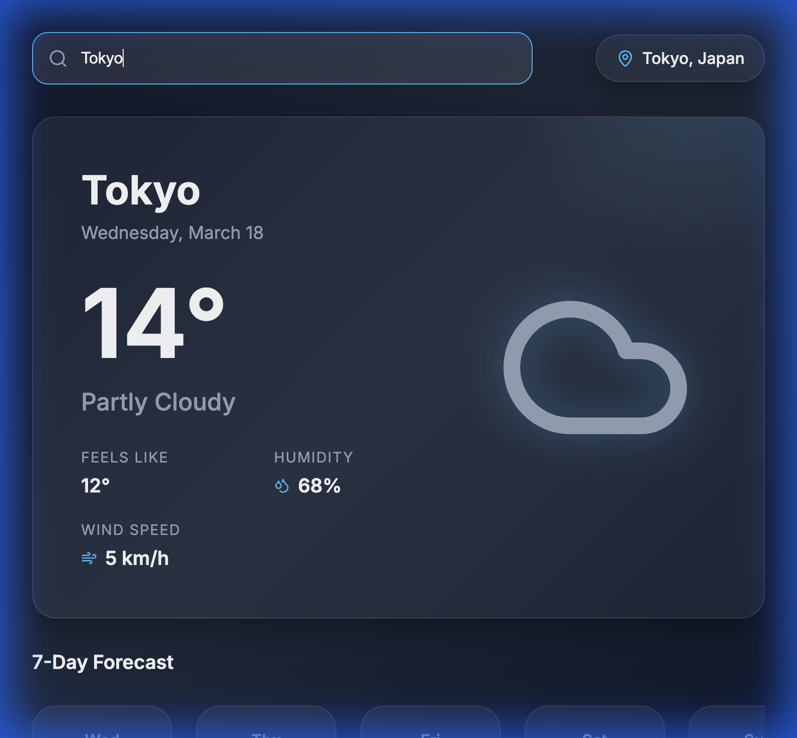

# SkyCast - Modern Weather App

SkyCast is a premium, visually stunning weather application that provides real-time weather data and a 7-day forecast for any location worldwide. Built with **React** and **Vite**, it features a modern glassmorphism design and uses the **Open-Meteo API** for reliable data.



## ✨ Features

- **Global Search**: Instantly find weather data for any city or country.
- **Glassmorphism Aesthetic**: A modern, dark-themed UI with soft gradients and glowing effects.
- **Real-time Metrics**: Current temperature, "Feels Like", humidity, and wind speed.
- **7-Day Forecast**: Weekly outlook with detailed daily highs and lows.
- **Responsive Design**: Optimized for both mobile and desktop viewing.

## 🚀 Getting Started

### Prerequisites

- [Node.js](https://nodejs.org/) (v18 or higher recommended)
- [npm](https://www.npmjs.com/)

### Installation

1. **Clone the repository**:
   ```bash
   git clone https://github.com/mahatodevi-arch/weather-app.git
   ```

2. **Navigate to the project directory**:
   ```bash
   cd weather-app
   ```

3. **Install dependencies**:
   ```bash
   npm install
   ```

4. **Run the development server**:
   ```bash
   npm run dev
   ```

5. **Open your browser**:
   Navigate to `http://localhost:5173/` to see the app in action!

## 🛠️ Tech Stack

- **React**: Frontend framework.
- **Vite**: Rapid development build tool.
- **Vanilla CSS**: Custom design system with glassmorphism.
- **Lucide React**: High-quality SVG icons.
- **Open-Meteo**: Weather and Geocoding APIs.

## 📄 License

This project is open-source and available under the [MIT License](LICENSE).
